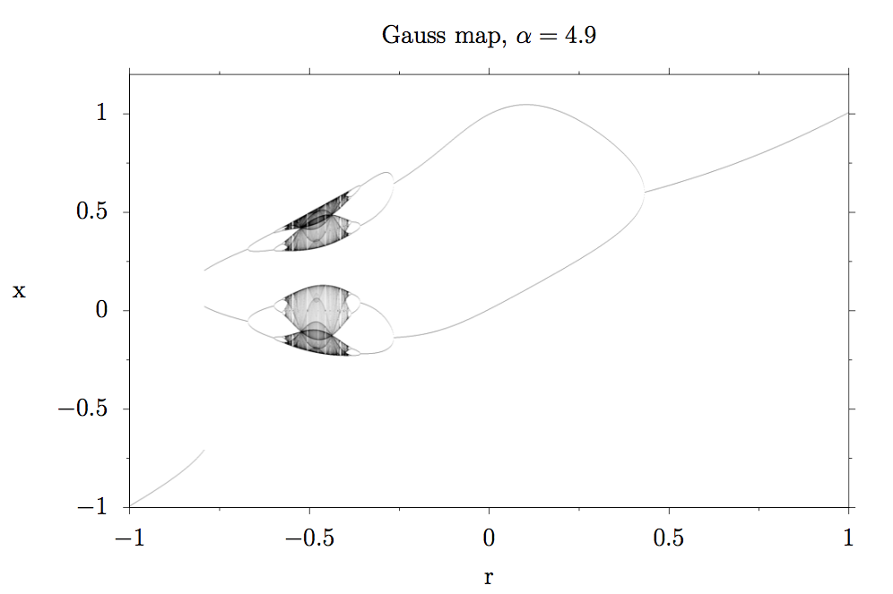
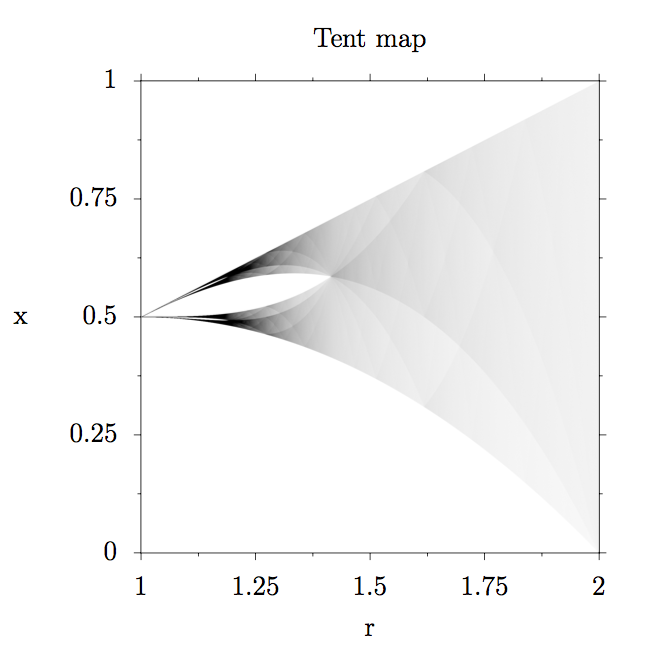

# Bifurcation diagrams of chaotic maps

Blog post explaining bifurcation diagrams can be found here:

Creates bifurcation diagrams of chaotic maps and animations like these:

* [Zooming into the bifurcation diagram of the logistic map](https://www.youtube.com/watch?v=A7vgbm3EV2k)

* [Bifurcation diagram of the gauss map varying alpha from 3.5 to 8](https://www.youtube.com/watch?v=vC_-KRzbpoI)

### Usage: 
`main.cpp` shows several examples of how to create bifurcation diagrams and animations thereof.
If you notice that the bifurcations are blurry, increase `transient`, if the chaotic regions are noisy, increase `samples`.

Runtime is $\mathcal O\Bigl(\text{Num of frames}\cdot \text{frame width}\cdot\bigl(\text{transient}+\text{samples}+\text{frame height}\bigr)\Bigr)$

If your computer currently does not support OpenMP, remove the flag `-fopenmp` from the makefile.

Convert the created bitmaps to png (install `imagemagick`):

`mogrify -format png bifurcation.bmp`

Create a video from individual frames (install `ffmpeg`):

`convert -delay 1 *.bmp video.mp4`

### Examples

